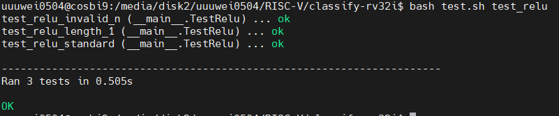
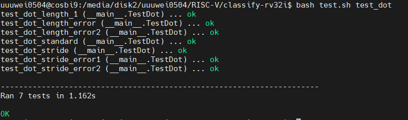
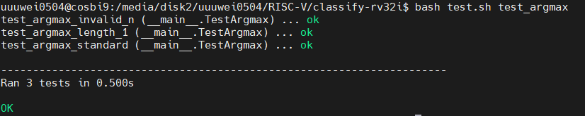
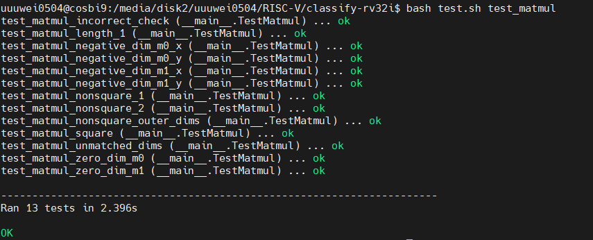
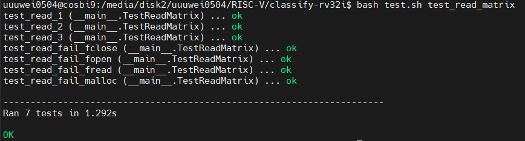
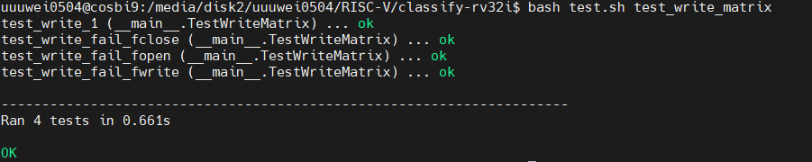
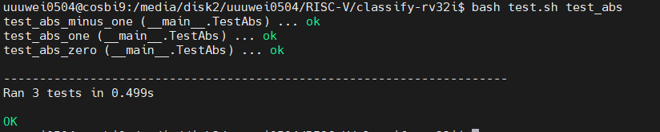
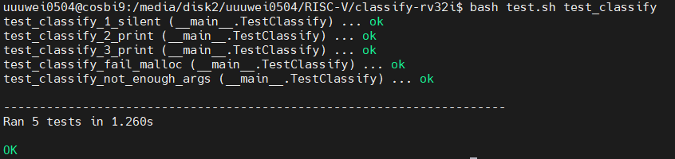
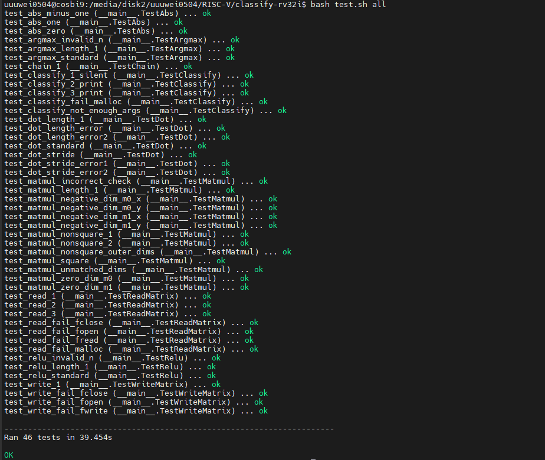

# Assignment 2: RISC-V Assembly and Instruction Pipeline

## Project Overview
This project focuses on implementing fundamental functions using the RISC-V assembly language. It includes:
- ReLU (Rectified Linear Unit) for non-linear activation in neural networks.
- ArgMax function to determine the index of the maximum value.
- Basic matrix operations such as dot product and matrix multiplication.

These implementations are designed for educational purposes, specifically in understanding the RISC-V instruction set and its application in deep learning.

---

## Features
1. **ReLU Function**: Implements the formula:
   $$
   f(x) = \max(0, x)
   $$
   - Outputs `x` if `x > 0`.
   - Outputs `0` if `x ≤ 0`.

2. **ArgMax Function**: Identifies the index of the maximum value in an array.

3. **Matrix Operations**:
   - Dot Product: Computes the scalar product of two vectors.
   - Matrix Multiplication: Multiplies two matrices efficiently.

---

# Relu function:
ReLU (Rectified Linear Unit) is a widely used activation function in deep learning. Its primary role is to introduce non-linearity, enabling neural networks to learn more complex patterns.

$$
f(x) = \max(0, x)
$$

This means:

- When the input `x > 0`, the output is `f(x) = x`.
- When the input `x ≤ 0`, the output is `f(x) = 0`.


### RISC-V

```asm
.globl relu

.text
# ==============================================================================
# FUNCTION: Array ReLU Activation
#
# Applies ReLU (Rectified Linear Unit) operation in-place:
# For each element x in array: x = max(0, x)
#
# Arguments:
#   a0: Pointer to integer array to be modified
#   a1: Number of elements in array
#
# Returns:
#   None - Original array is modified directly
#
# Validation:
#   Requires non-empty array (length ≥ 1)
#   Terminates (code 36) if validation fails
#
# Example:
#   Input:  [-2, 0, 3, -1, 5]
#   Result: [ 0, 0, 3,  0, 5]
# ==============================================================================
relu:
    li t0, 1             
    blt a1, t0, error     
    li t1, 0       

loop_start:
    bge t1, a1, return      
    slli t2, t1, 2       
    add t3, a0, t2      
    lw t4, 0(t3)         

    blez t4, replace      
    j next                
replace:
    sw x0, 0(t3)
next:
    addi t1, t1, 1       
    j loop_start          
error:
    li a0, 36            
    j exit
return:
    jr ra 

```
## result:


The primary purpose of this program is to process each element in an array as follows:  
- If the element's value is greater than 0, it remains unchanged.  
- If the element's value is less than or equal to 0, it is set to 0.  

Additionally, the program includes input length validation to prevent invalid operations.


----
# dot function


The dot product of two vectors is a scalar value obtained by multiplying corresponding elements of two vectors and summing up the results.

## Formula:

$$
\text{Dot Product} = \sum_{i=1}^{n} \left( A[i] \cdot B[i] \right)
$$

**Where:**
- \( A \) and \( B \) are vectors.
- \( n \) is the length of the vectors.


## RISC-V
```asm
.globl dot

.text
# =======================================================
# FUNCTION: Strided Dot Product Calculator
#
# Calculates sum(arr0[i * stride0] * arr1[i * stride1])
# where i ranges from 0 to (element_count - 1)
#
# Args:
#   a0 (int *): Pointer to first input array
#   a1 (int *): Pointer to second input array
#   a2 (int):   Number of elements to process
#   a3 (int):   Skip distance in first array
#   a4 (int):   Skip distance in second array
#
# Returns:
#   a0 (int):   Resulting dot product value
#
# Preconditions:
#   - Element count must be positive (>= 1)
#   - Both strides must be positive (>= 1)
#
# Error Handling:
#   - Exits with code 36 if element count < 1
#   - Exits with code 37 if any stride < 1
# =======================================================
dot:
   
    li t0, 1
    blt a2, t0, error_terminate  
    blt a3, t0, error_terminate   
    blt a4, t0, error_terminate  

    addi sp, sp,-8
    sw t0, 0(sp)
    sw ra, 4(sp)	
    li t0, 0          # t0 = result
    li t1, 0          # t1 = index i
    slli t2, a3, 2    # t2 = a3 * 4 
    slli t3, a4, 2    # t3 = a4 * 4 

loop_start:
    bge t1, a2, loop_end


    lw t4, 0(a0)     # t4 = arr1[i]
    lw t5, 0(a1)     # t5 = arr2[i]
    addi sp,sp,-16
   
    sw a0,0(sp)
    sw a1,4(sp)
    sw a2,8(sp)
    sw a5,12(sp)	
    mv a1,t4
    mv a2,t5

    jal mul_function
    #mul a0, a1, a2

    add t0, t0, a0   # result += t6
    lw a0,0(sp)
    lw a1,4(sp)
    lw a2,8(sp)
    lw a5,12(sp)
    addi sp,sp,16

    add a0, a0, t2   
    add a1, a1, t3   


    addi t1, t1, 1
    j loop_start

loop_end:

    mv a0, t0
    lw t0, 0(sp)
    lw ra, 4(sp)
    addi sp, sp, 8

    jr ra

error_terminate:
    blt a2, t0, set_error_36
    li a0, 37
    j exit

set_error_36:
    li a0, 36
    j exit


mul_function:
    addi sp, sp, -16      
    sw s0, 0(sp)      
    sw s1, 4(sp)      
    sw s2, 8(sp)       
    sw s3, 12(sp)      

    li s0, 0          

mul_loop:
    andi s3, a2, 1        
    beqz s3, skip_add1    
    add s0, s0, a1       

skip_add1:
    slli a1, a1, 1        
    srli a2, a2, 1
    bnez a2, mul_loop       

    mv a0, s0          

    lw s0, 0(sp)       
    lw s1, 4(sp)       
    lw s2, 8(sp)        
    lw s3, 12(sp)      
    addi sp, sp, 16     

    ret


multiply: 
    
    li a0, 0 
multiply_loop:
    andi a5, a2, 1     
    beqz a5, skip_add  
    add a0, a0, a1     

skip_add:
    slli a1, a1, 1      
    srli a2, a2, 1      
    bnez a2, multiply_loop 
    ret    

```

## result:




## Steps to Implement Dot Product

Below are the main steps to implement the dot product:


### Step 1: Input Validation
In the implementation, the first step is to validate the input:
- Check whether the input is valid (e.g., whether the two vectors have the same length).
- If the lengths do not match or the data is invalid, throw an error or handle the error appropriately.


### Step 2: Initialization
- Initialize a variable to store the result, e.g., `result = 0`.
- Use a loop variable `i` to iterate through each element of the vectors.


### Step 3: Compute the Dot Product
Inside the loop:
- Retrieve the corresponding elements from the two vectors, `A[i]` and `B[i]`.
- Multiply these elements and add the product to `result`.


### Step 4: Return the Result
- After completing the loop, return the accumulated `result` as the final dot product.


# ArgMax Function Introduction

The **ArgMax** function is widely used in mathematics, machine learning, and data analysis to find the index of the maximum value in a list or array.


## Definition
The ArgMax function is defined as:
$$
\text{ArgMax}(A) = \text{arg} \, \max_{i} \, A[i]
$$

Where:
- $A$ is a list or array of numbers.
- $\text{ArgMax}(A)$ returns the index $i$ where the value $A[i]$ is the largest in the array.


## Example
If \( A = [1, 3, 7, 2, 5] \), then:
\[
\text{ArgMax}(A) = 2
\]
because \( A[2] = 7 \) is the maximum value.


## Key Characteristics
- **Input**: A list or array of numerical values.
- **Output**: The index of the maximum value in the input array.
- **When multiple maximum values exist**: Typically, the index of the first occurrence is returned.

## RISC-V
```asm
.globl argmax

.text
# =================================================================
# FUNCTION: Maximum Element First Index Finder
#
# Scans an integer array to find its maximum value and returns the
# position of its first occurrence. In cases where multiple elements
# share the maximum value, returns the smallest index.
#
# Arguments:
#   a0 (int *): Pointer to the first element of the array
#   a1 (int):  Number of elements in the array
#
# Returns:
#   a0 (int):  Position of the first maximum element (0-based index)
#
# Preconditions:
#   - Array must contain at least one element
#
# Error Cases:
#   - Terminates program with exit code 36 if array length < 1
# =================================================================
argmax:
    li t6, 1
    blt a1, t6, handle_error   #i>size時跳出

    lw t0, 0(a0) 

    li t1, 0
    li t2, 0
loop_start:
    addi t2,t2,1
    bge t2,a1 return
    slli t4,t2,2
    add t3,t4,a0
    lw t5,0(t3) #t3是array[i]的值
    blt t5,t0 loop_start
    mv t0,t5
    mv t1,t2
    j loop_start

    
    # TODO: Add your own implementation

handle_error:
    li a0, 36
    j exit
return:
    mv a0,t1
    jr ra

```

## result:




---

# Shift-and-Add Multiplier Explanation

My multiplier is based on the **Shift-and-Add method**, which is a classic approach for implementing binary multiplication in low-level hardware. The following explains its working principle:

---

## 1. Basic Concept

Binary multiplication can be seen as a combination of repeated addition and shifting:

- If a bit in the multiplier is `1`, the multiplicand is added to the result.
- After checking each bit of the multiplier:
  - The multiplicand is shifted left (equivalent to multiplying by 2).
  - The multiplier is shifted right (equivalent to dividing by 2), until all bits in the multiplier are processed.

---

## 2. Operational Steps

### **Initialize the Accumulator**
- Use an accumulator (e.g., `s0`) to store the final multiplication result.
- The initial value of the accumulator is set to 0.

### **Check the Multiplier Bits**
- Extract the least significant bit (LSB) of the multiplier using an AND operation.
- If the bit is `1`, add the current multiplicand to the accumulator. 
- If the bit is `0`, skip the addition step.

### **Perform the Shifting**
- After processing each bit:
  - Shift the multiplicand left by one position (representing multiplication by 2).
  - Shift the multiplier right by one position (representing division by 2 and removing the processed bit).

### **Repeat Until Completion**
- Repeat the above steps until all bits of the multiplier have been processed.

---

This method iteratively builds the result in the accumulator. The final value in the accumulator represents the multiplication result.


## RISC-V

```asm
mul_function:
    addi sp, sp, -16      
    sw s0, 0(sp)      
    sw s1, 4(sp)      
    sw s2, 8(sp)       
    sw s3, 12(sp)      

    li s0, 0          

mul_loop:
    andi s3, a2, 1        
    beqz s3, skip_add1    
    add s0, s0, a1       

skip_add1:
    slli a1, a1, 1        
    srli a2, a2, 1
    bnez a2, mul_loop       

    mv a0, s0          

    lw s0, 0(sp)       
    lw s1, 4(sp)       
    lw s2, 8(sp)        
    lw s3, 12(sp)      
    addi sp, sp, 16     

    ret
    
```
## Implementation of Multiplication using Custom Function

This section demonstrates how to replace the direct `mul t0, t4, t5` instruction with a custom multiplication function (`mul_function`). This approach leverages stack operations and a subroutine to compute the multiplication result manually. Below is the detailed explanation of the process.

---

## Code Overview

```asm
addi sp, sp, -16        # Allocate stack space
sw a0, 0(sp)            # Save a0 on the stack
sw a1, 4(sp)            # Save a1 on the stack
sw a2, 8(sp)            # Save a2 on the stack
sw a5, 12(sp)           # Save a5 on the stack

mv a1, t4               # Move multiplier (t4) to a1
mv a2, t5               # Move multiplicand (t5) to a2

jal mul_function        # Call the multiplication function
# mul a0, a1, a2        # (Replaced with custom implementation)

add t0, t0, a0          # Accumulate the result: t0 += a0

lw a0, 0(sp)            # Restore a0 from the stack
lw a1, 4(sp)            # Restore a1 from the stack
lw a2, 8(sp)            # Restore a2 from the stack
lw a5, 12(sp)           # Restore a5 from the stack
addi sp, sp, 16         # Free stack space
```
---

# matmul function
## Matrix Multiplication Introduction

Matrix multiplication is a linear algebra operation that calculates the product of two matrices. Suppose we have two matrices $M0$ and $M1$:

- $M0$: Dimensions $rows_0 \times cols_0$
- $M1$: Dimensions $rows_1 \times cols_1$

---

## **Conditions for Matrix Multiplication**

To perform matrix multiplication, the following conditions must be satisfied:
1. $cols_0 = rows_1$: The number of columns in $M0$ must equal the number of rows in $M1$.
2. The resulting matrix $D$ will have dimensions $rows_0 \times cols_1$.

---

## **Computation Process**

The core of matrix multiplication is based on **row-by-column dot product operations**.

### **Result Matrix Elements**
Each element of the resulting matrix $D[i][j]$ is calculated as the dot product of the $i$-th row of $M0$ and the $j$-th column of $M1$:
$$
D[i][j] = \sum_{k=0}^{cols_0-1} M0[i][k] \cdot M1[k][j]
$$
Where:
- $i$: Row index of $M0$
- $j$: Column index of $M1$
- $k$: Intermediate index for dot product computation

---

## **How to Iterate Through Matrices**

1. **Outer Loop**:
   - Iterate over each row of $M0$ (indexed by $i$).
2. **Middle Loop**:
   - Iterate over each column of $M1$ (indexed by $j$).
3. **Inner Loop**:
   - Perform the dot product of the $i$-th row of $M0$ with the $j$-th column of $M1$.
   - Accumulate the products $M0[i][k] \cdot M1[k][j]$ into $D[i][j]$.

---

## **Result Storage**
- After computing the dot product for a specific pair of $i$ and $j$, store the result in the corresponding position $D[i][j]$ of the result matrix $D$.

## RISC-V

```asm
.globl matmul

.text
# =======================================================
# FUNCTION: Matrix Multiplication Implementation
#
# Performs operation: D = M0 × M1
# Where:
#   - M0 is a (rows0 × cols0) matrix
#   - M1 is a (rows1 × cols1) matrix
#   - D is a (rows0 × cols1) result matrix
#
# Arguments:
#   First Matrix (M0):
#     a0: Memory address of first element
#     a1: Row count
#     a2: Column count
#
#   Second Matrix (M1):
#     a3: Memory address of first element
#     a4: Row count
#     a5: Column count
#
#   Output Matrix (D):
#     a6: Memory address for result storage
#
# Validation (in sequence):
#   1. Validates M0: Ensures positive dimensions
#   2. Validates M1: Ensures positive dimensions
#   3. Validates multiplication compatibility: M0_cols = M1_rows
#   All failures trigger program exit with code 38
#
# Output:
#   None explicit - Result matrix D populated in-place
# =======================================================
matmul:
    # Error checks
    li t0 1
    blt a1, t0, error
    blt a2, t0, error
    blt a4, t0, error
    blt a5, t0, error
    bne a2, a4, error

    # Prologue
    addi sp, sp, -28
    sw ra, 0(sp)
    
    sw s0, 4(sp)
    sw s1, 8(sp)
    sw s2, 12(sp)
    sw s3, 16(sp)
    sw s4, 20(sp)
    sw s5, 24(sp)
    
    li s0, 0 # outer loop counter
    li s1, 0 # inner loop counter
    mv s2, a6 # incrementing result matrix pointer
    mv s3, a0 # incrementing matrix A pointer, increments durring outer loop
    mv s4, a3 # incrementing matrix B pointer, increments during inner loop 
    
outer_loop_start:
    #s0 is going to be the loop counter for the rows in A
    li s1, 0
    mv s4, a3
    blt s0, a1, inner_loop_start

    j outer_loop_end
    
inner_loop_start:
# HELPER FUNCTION: Dot product of 2 int arrays
# Arguments:
#   a0 (int*) is the pointer to the start of arr0
#   a1 (int*) is the pointer to the start of arr1
#   a2 (int)  is the number of elements to use = number of columns of A, or number of rows of B
#   a3 (int)  is the stride of arr0 = for A, stride = 1
#   a4 (int)  is the stride of arr1 = for B, stride = len(rows) - 1
# Returns:
#   a0 (int)  is the dot product of arr0 and arr1
    beq s1, a5, inner_loop_end

    addi sp, sp, -24
    sw a0, 0(sp)
    sw a1, 4(sp)
    sw a2, 8(sp)
    sw a3, 12(sp)
    sw a4, 16(sp)
    sw a5, 20(sp)
    
    mv a0, s3 # setting pointer for matrix A into the correct argument value
    mv a1, s4 # setting pointer for Matrix B into the correct argument value
    mv a2, a2 # setting the number of elements to use to the columns of A
    li a3, 1 # stride for matrix A
    mv a4, a5 # stride for matrix B
    
    jal dot
    
    mv t0, a0 # storing result of the dot product into t0
    
    lw a0, 0(sp)
    lw a1, 4(sp)
    lw a2, 8(sp)
    lw a3, 12(sp)
    lw a4, 16(sp)
    lw a5, 20(sp)
    addi sp, sp, 24
    
    sw t0, 0(s2)
    addi s2, s2, 4 # Incrememtning pointer for result matrix
    
    li t1, 4
    add s4, s4, t1 # incrememtning the column on Matrix B
    
    addi s1, s1, 1
    j inner_loop_start
    
inner_loop_end:
    # TODO: Add your own implementation

#===========================================
    addi s0, s0, 1     
    slli t0, a2, 2
    add  s3, s3,t0
    j outer_loop_start  


outer_loop_end:
    lw ra, 0(sp)
    lw s0, 4(sp)
    lw s1, 8(sp)
    lw s2, 12(sp)
    lw s3, 16(sp)
    lw s4, 20(sp)
    lw s5, 24(sp)
    addi sp, sp, 28
    ret  
    
error:
    li a0, 38
    j exit
#==========================================

```
## result:




---


# read_matrix:

```asm
.globl read_matrix

.text
# ==============================================================================
# FUNCTION: Binary Matrix File Reader
#
# Loads matrix data from a binary file into dynamically allocated memory.
# Matrix dimensions are read from file header and stored at provided addresses.
#
# Binary File Format:
#   Header (8 bytes):
#     - Bytes 0-3: Number of rows (int32)
#     - Bytes 4-7: Number of columns (int32)
#   Data:
#     - Subsequent 4-byte blocks: Matrix elements
#     - Stored in row-major order: [row0|row1|row2|...]
#
# Arguments:
#   Input:
#     a0: Pointer to filename string
#     a1: Address to write row count
#     a2: Address to write column count
#
#   Output:
#     a0: Base address of loaded matrix
#
# Error Handling:
#   Program terminates with:
#   - Code 26: Dynamic memory allocation failed
#   - Code 27: File access error (open/EOF)
#   - Code 28: File closure error
#   - Code 29: Data read error
#
# Memory Note:
#   Caller is responsible for freeing returned matrix pointer
# ==============================================================================
read_matrix:
    
    # Prologue
    addi sp, sp, -40
    sw ra, 0(sp)
    sw s0, 4(sp)
    sw s1, 8(sp)
    sw s2, 12(sp)
    sw s3, 16(sp)
    sw s4, 20(sp)

    mv s3, a1         # save and copy rows
    mv s4, a2         # save and copy cols

    li a1, 0

    jal fopen

    li t0, -1
    beq a0, t0, fopen_error   # fopen didn't work

    mv s0, a0        # file

    # read rows n columns
    mv a0, s0
    addi a1, sp, 28  # a1 is a buffer

    li a2, 8         # look at 2 numbers

    jal fread

    li t0, 8
    bne a0, t0, fread_error

    lw t1, 28(sp)    # opening to save num rows
    lw t2, 32(sp)    # opening to save num cols

    sw t1, 0(s3)     # saves num rows
    sw t2, 0(s4)     # saves num cols

    # mul s1, t1, t2   # s1 is number of elements
    # FIXME: Replace 'mul' with your own implementation
#-----------------------------------------------------------
    addi sp, sp, -8
    sw a1, 0(sp)
    sw a2, 4(sp)
    mv a1, t1
    mv a2, t2
    jal mul_function
    mv s1, a0
    lw a1, 0(sp)
    lw a2, 4(sp)
    addi sp, sp, 8
#-----------------------------------------------------------

    slli t3, s1, 2
    sw t3, 24(sp)    # size in bytes

    lw a0, 24(sp)    # a0 = size in bytes

    jal malloc

    beq a0, x0, malloc_error

    # set up file, buffer and bytes to read
    mv s2, a0        # matrix
    mv a0, s0
    mv a1, s2
    lw a2, 24(sp)

    jal fread

    lw t3, 24(sp)
    bne a0, t3, fread_error

    mv a0, s0

    jal fclose

    li t0, -1

    beq a0, t0, fclose_error

    mv a0, s2

    # Epilogue
    lw ra, 0(sp)
    lw s0, 4(sp)
    lw s1, 8(sp)
    lw s2, 12(sp)
    lw s3, 16(sp)
    lw s4, 20(sp)
    addi sp, sp, 40

    jr ra

malloc_error:
    li a0, 26
    j error_exit

fopen_error:
    li a0, 27
    j error_exit

fread_error:
    li a0, 29
    j error_exit

fclose_error:
    li a0, 28
    j error_exit

error_exit:
    lw ra, 0(sp)
    lw s0, 4(sp)
    lw s1, 8(sp)
    lw s2, 12(sp)
    lw s3, 16(sp)
    lw s4, 20(sp)
    addi sp, sp, 40
    j exit
    
    
mul_function:
    addi sp, sp, -16      
    sw s0, 0(sp)      
    sw s1, 4(sp)      
    sw s2, 8(sp)       
    sw s3, 12(sp)      

    li s0, 0          

mul_loop:
    andi s3, a2, 1        
    beqz s3, skip_add    
    add s0, s0, a1       

skip_add:
    slli a1, a1, 1        
    srli a2, a2, 1
    bnez a2, mul_loop       

    mv a0, s0          

    lw s0, 0(sp)       
    lw s1, 4(sp)       
    lw s2, 8(sp)        
    lw s3, 12(sp)      
    addi sp, sp, 16     

    jr ra  

```


### Replace `mul` Instruction with Custom Implementation

### Original Code
```assembly
mul s1, t1, t2   # s1 is the number of elements
```
### Task
Replace mul s1, t1, t2 with my own implementation.

### Note:
I used my own mul_function to replace mul s1, t1, t2, and the result is also correct.
## result:



---

# write_matrix:

```asm
.globl write_matrix

.text
# ==============================================================================
# FUNCTION: Write a matrix of integers to a binary file
# FILE FORMAT:
#   - The first 8 bytes store two 4-byte integers representing the number of 
#     rows and columns, respectively.
#   - Each subsequent 4-byte segment represents a matrix element, stored in 
#     row-major order.
#
# Arguments:
#   a0 (char *) - Pointer to a string representing the filename.
#   a1 (int *)  - Pointer to the matrix's starting location in memory.
#   a2 (int)    - Number of rows in the matrix.
#   a3 (int)    - Number of columns in the matrix.
#
# Returns:
#   None
#
# Exceptions:
#   - Terminates with error code 27 on `fopen` error or end-of-file (EOF).
#   - Terminates with error code 28 on `fclose` error or EOF.
#   - Terminates with error code 30 on `fwrite` error or EOF.
# ==============================================================================
write_matrix:
    # Prologue
    addi sp, sp, -44
    sw ra, 0(sp)
    sw s0, 4(sp)
    sw s1, 8(sp)
    sw s2, 12(sp)
    sw s3, 16(sp)
    sw s4, 20(sp)

    # save arguments
    mv s1, a1        # s1 = matrix pointer
    mv s2, a2        # s2 = number of rows
    mv s3, a3        # s3 = number of columns

    li a1, 1

    jal fopen

    li t0, -1
    beq a0, t0, fopen_error   # fopen didn't work

    mv s0, a0        # file descriptor

    # Write number of rows and columns to file
    sw s2, 24(sp)    # number of rows
    sw s3, 28(sp)    # number of columns

    mv a0, s0
    addi a1, sp, 24  # buffer with rows and columns
    li a2, 2         # number of elements to write
    li a3, 4         # size of each element

    jal fwrite

    li t0, 2
    bne a0, t0, fwrite_error

    # mul s4, s2, s3   # s4 = total elements
    # FIXME: Replace 'mul' with your own implementation
    li s4 ,0
#---------------------------------------------------------------
mul_loop:
    andi t1, s3, 1      
    beqz t1, skip_add1   
    add  s4, s4, s2     
skip_add1:
    slli s2, s2, 1      
    srli s3, s3, 1      
    bnez s3, mul_loop  
#---------------------------------------------------------------
    # write matrix data to file
    mv a0, s0
    mv a1, s1        # matrix data pointer
    mv a2, s4        # number of elements to write
    li a3, 4         # size of each element

    jal fwrite

    bne a0, s4, fwrite_error

    mv a0, s0

    jal fclose

    li t0, -1
    beq a0, t0, fclose_error

    # Epilogue
    lw ra, 0(sp)
    lw s0, 4(sp)
    lw s1, 8(sp)
    lw s2, 12(sp)
    lw s3, 16(sp)
    lw s4, 20(sp)
    addi sp, sp, 44

    jr ra

fopen_error:
    li a0, 27
    j error_exit

fwrite_error:
    li a0, 30
    j error_exit

fclose_error:
    li a0, 28
    j error_exit

error_exit:
    lw ra, 0(sp)
    lw s0, 4(sp)
    lw s1, 8(sp)
    lw s2, 12(sp)
    lw s3, 16(sp)
    lw s4, 20(sp)
    addi sp, sp, 44
    j exit

```

### Task
Replace mul s4, s2, s3 with my own implementation.

### Note:
I used my own mul_function to replace mul s4, s2, s3, and the result is also correct.
## result:




---

# abs function
```asm
.globl abs

.text
# =================================================================
# FUNCTION: Absolute Value Converter
#
# Transforms any integer into its absolute (non-negative) value by
# modifying the original value through pointer dereferencing.
# For example: -5 becomes 5, while 3 remains 3.
#
# Args:
#   a0 (int *): Memory address of the integer to be converted
#
# Returns:
#   None - The operation modifies the value at the pointer address
# =================================================================
abs:
    # Prologue
    ebreak
    # Load number from memory
    lw t0 0(a0)
    
    bge t0, zero, done
    
    sub t0,zero,t0
    sw t0,0(a0)

    


    # TODO: Add your own implementation

done:

    jr ra

```

## Additional Code
When it is necessary to convert `t0` to `-t0`, add the following two lines to ensure proper operation:

```assembly
sub t0, zero, t0   # Convert t0 to -t0
sw t0, 0(a0)       # Store t0 at memory address a0
```

## result:



----

# classify.s:

classify will have a total of four multipliers to modify:

```asm
mul a0, t0, t1 # FIXME: Replace 'mul' with your own implementation

mul a1, t0, t1 # FIXME: Replace 'mul' with your own implementation
    
mul a0, t0, t1 # FIXME: Replace 'mul' with your own implementation

mul a1, t0, t1 # FIXME: Replace 'mul' with your own implementation
    
```
Here, I used four separate multipliers to complete the task. Initially, I implemented a shared multiplier for all operations, but this approach encountered issues with unknown chain.s problems. Therefore, I decided to use four distinct multipliers in the implementation to resolve this problem effectively

```asm
.globl classify

.text
# =====================================
# NEURAL NETWORK CLASSIFIER
# =====================================
# Description:
#   Command line program for matrix-based classification
#
# Command Line Arguments:
#   1. M0_PATH      - First matrix file location
#   2. M1_PATH      - Second matrix file location
#   3. INPUT_PATH   - Input matrix file location
#   4. OUTPUT_PATH  - Output file destination
#
# Register Usage:
#   a0 (int)        - Input: Argument count
#                   - Output: Classification result
#   a1 (char **)    - Input: Argument vector
#   a2 (int)        - Input: Silent mode flag
#                     (0 = verbose, 1 = silent)
#
# Error Codes:
#   31 - Invalid argument count
#   26 - Memory allocation failure
#
# Usage Example:
#   main.s <M0_PATH> <M1_PATH> <INPUT_PATH> <OUTPUT_PATH>
# =====================================
classify:
    # Error handling
    li t0, 5
    blt a0, t0, error_args
    
    # Prolouge
    addi sp, sp, -48
    
    sw ra, 0(sp)
    
    sw s0, 4(sp) # m0 matrix
    sw s1, 8(sp) # m1 matrix
    sw s2, 12(sp) # input matrix
    
    sw s3, 16(sp) # m0 matrix rows
    sw s4, 20(sp) # m0 matrix cols
    
    sw s5, 24(sp) # m1 matrix rows
    sw s6, 28(sp) # m1 matrix cols
     
    sw s7, 32(sp) # input matrix rows
    sw s8, 36(sp) # input matrix cols
    sw s9, 40(sp) # h
    sw s10, 44(sp) # o
    
    # Read pretrained m0
    
    addi sp, sp, -12
    
    sw a0, 0(sp)
    sw a1, 4(sp)
    sw a2, 8(sp)
    
    li a0, 4
    jal malloc # malloc 4 bytes for an integer, rows
    beq a0, x0, error_malloc
    mv s3, a0 # save m0 rows pointer for later
    
    li a0, 4
    jal malloc # malloc 4 bytes for an integer, cols
    beq a0, x0, error_malloc
    mv s4, a0 # save m0 cols pointer for later
    
    lw a1, 4(sp) # restores the argument pointer
    
    lw a0, 4(a1) # set argument 1 for the read_matrix function  
    mv a1, s3 # set argument 2 for the read_matrix function
    mv a2, s4 # set argument 3 for the read_matrix function
    
    jal read_matrix
    
    mv s0, a0 # setting s0 to the m0, aka the return value of read_matrix
    
    lw a0, 0(sp)
    lw a1, 4(sp)
    lw a2, 8(sp)
    
    addi sp, sp, 12
    # Read pretrained m1
    
    addi sp, sp, -12
    
    sw a0, 0(sp)
    sw a1, 4(sp)
    sw a2, 8(sp)
    
    li a0, 4
    jal malloc # malloc 4 bytes for an integer, rows
    beq a0, x0, error_malloc
    mv s5, a0 # save m1 rows pointer for later
    
    li a0, 4
    jal malloc # malloc 4 bytes for an integer, cols
    beq a0, x0, error_malloc
    mv s6, a0 # save m1 cols pointer for later
    
    lw a1, 4(sp) # restores the argument pointer
    
    lw a0, 8(a1) # set argument 1 for the read_matrix function  
    mv a1, s5 # set argument 2 for the read_matrix function
    mv a2, s6 # set argument 3 for the read_matrix function
    
    jal read_matrix
    
    mv s1, a0 # setting s1 to the m1, aka the return value of read_matrix
    
    lw a0, 0(sp)
    lw a1, 4(sp)
    lw a2, 8(sp)
    
    addi sp, sp, 12

    # Read input matrix
    
    addi sp, sp, -12
    
    sw a0, 0(sp)
    sw a1, 4(sp)
    sw a2, 8(sp)
    
    li a0, 4
    jal malloc # malloc 4 bytes for an integer, rows
    beq a0, x0, error_malloc
    mv s7, a0 # save input rows pointer for later
    
    li a0, 4
    jal malloc # malloc 4 bytes for an integer, cols
    beq a0, x0, error_malloc
    mv s8, a0 # save input cols pointer for later
    
    lw a1, 4(sp) # restores the argument pointer
    
    lw a0, 12(a1) # set argument 1 for the read_matrix function  
    mv a1, s7 # set argument 2 for the read_matrix function
    mv a2, s8 # set argument 3 for the read_matrix function
    
    jal read_matrix
    
    mv s2, a0 # setting s2 to the input matrix, aka the return value of read_matrix
    
    lw a0, 0(sp)
    lw a1, 4(sp)
    lw a2, 8(sp)
    
    addi sp, sp, 12

    # Compute h = matmul(m0, input)
    addi sp, sp, -28
    
    sw a0, 0(sp)
    sw a1, 4(sp)
    sw a2, 8(sp)
    sw a3, 12(sp)
    sw a4, 16(sp)
    sw a5, 20(sp)
    sw a6, 24(sp)
    
    lw t0, 0(s3)
    lw t1, 0(s8)
#------------------------------------------------------------------------------
    #mul a0, t0, t1 # FIXME: Replace 'mul' with your own implementation
    li      a0, 0            
    li      t2, 0            
    li      t3, 32
mul_loop1:
    andi    t4, t1, 1         
    beqz    t4, skip_add1      
    add     a0, a0, t0        

skip_add1:
    slli    t0, t0, 1         
    srli    t1, t1, 1        
    addi    t2, t2, 1         
    blt     t2, t3, mul_loop1
#------------------------------------------------------------------------------
    slli a0, a0, 2
    jal malloc 
    beq a0, x0, error_malloc
    mv s9, a0 # move h to s9
    
    mv a6, a0 # h 
    
    mv a0, s0 # move m0 array to first arg
    lw a1, 0(s3) # move m0 rows to second arg
    lw a2, 0(s4) # move m0 cols to third arg
    
    mv a3, s2 # move input array to fourth arg
    lw a4, 0(s7) # move input rows to fifth arg
    lw a5, 0(s8) # move input cols to sixth arg
    
    jal matmul
    
    lw a0, 0(sp)
    lw a1, 4(sp)
    lw a2, 8(sp)
    lw a3, 12(sp)
    lw a4, 16(sp)
    lw a5, 20(sp)
    lw a6, 24(sp)
    
    addi sp, sp, 28
    
    # Compute h = relu(h)
    addi sp, sp, -8
    
    sw a0, 0(sp)
    sw a1, 4(sp)
    
    mv a0, s9 # move h to the first argument
    lw t0, 0(s3)
    lw t1, 0(s8)
#-----------------------------------------------------------------------------------
    #mul a1, t0, t1 # length of h array and set it as second argument
    # FIXME: Replace 'mul' with your own implementation
    li      a1, 0      
    li      t2, 0           
    li      t3, 32
mul_loop2:
    andi    t4, t1, 1        
    beqz    t4, skip_add2     
    add     a1, a1, t0        

skip_add2:
    slli    t0, t0, 1       
    srli    t1, t1, 1    
    addi    t2, t2, 1         
    blt     t2, t3, mul_loop2
#-----------------------------------------------------------------------------------
    jal relu
    
    lw a0, 0(sp)
    lw a1, 4(sp)
    
    addi sp, sp, 8
    
    # Compute o = matmul(m1, h)
    addi sp, sp, -28
    
    sw a0, 0(sp)
    sw a1, 4(sp)
    sw a2, 8(sp)
    sw a3, 12(sp)
    sw a4, 16(sp)
    sw a5, 20(sp)
    sw a6, 24(sp)
    
    lw t0, 0(s3)
    lw t1, 0(s6)
#-----------------------------------------------------------------------------------
    mul a0, t0, t1 # FIXME: Replace 'mul' with your own implementation
    li      a0, 0           
    li      t2, 0         
    li      t3, 32
mul_loop3:
    andi    t4, t1, 1        
    beqz    t4, skip_add3   
    add     a0, a0, t0      
skip_add3:
    slli    t0, t0, 1         
    srli    t1, t1, 1        
    addi    t2, t2, 1         
    blt     t2, t3, mul_loop3
#-----------------------------------------------------------------------------------
    slli a0, a0, 2
    jal malloc 
    beq a0, x0, error_malloc
    mv s10, a0 # move o to s10
    
    mv a6, a0 # o
    
    mv a0, s1 # move m1 array to first arg
    lw a1, 0(s5) # move m1 rows to second arg
    lw a2, 0(s6) # move m1 cols to third arg
    
    mv a3, s9 # move h array to fourth arg
    lw a4, 0(s3) # move h rows to fifth arg
    lw a5, 0(s8) # move h cols to sixth arg
    
    jal matmul
    
    lw a0, 0(sp)
    lw a1, 4(sp)
    lw a2, 8(sp)
    lw a3, 12(sp)
    lw a4, 16(sp)
    lw a5, 20(sp)
    lw a6, 24(sp)
    
    addi sp, sp, 28
    
    # Write output matrix o
    addi sp, sp, -16
    
    sw a0, 0(sp)
    sw a1, 4(sp)
    sw a2, 8(sp)
    sw a3, 12(sp)
    
    lw a0, 16(a1) # load filename string into first arg
    mv a1, s10 # load array into second arg
    lw a2, 0(s5) # load number of rows into fourth arg
    lw a3, 0(s8) # load number of cols into third arg
    
    jal write_matrix
    
    lw a0, 0(sp)
    lw a1, 4(sp)
    lw a2, 8(sp)
    lw a3, 12(sp)
    
    addi sp, sp, 16
    
    # Compute and return argmax(o)
    addi sp, sp, -12
    
    sw a0, 0(sp)
    sw a1, 4(sp)
    sw a2, 8(sp)
    
    mv a0, s10 # load o array into first arg
    lw t0, 0(s3)
    lw t1, 0(s6)
#-----------------------------------------------------------------------------------
    mul a1, t0, t1 # load length of array into second arg
    # FIXME: Replace 'mul' with your own implementation
    li      a1, 0           
    li      t2, 0           
    li      t3, 32
mul_loop4:
    andi    t4, t1, 1         
    beqz    t4, skip_add4    
    add     a1, a1, t0        

skip_add4:
    slli    t0, t0, 1        
    srli    t1, t1, 1         
    addi    t2, t2, 1         
    blt     t2, t3, mul_loop4 
#-----------------------------------------------------------------------------------
    jal argmax
    
    mv t0, a0 # move return value of argmax into t0
    
    lw a0, 0(sp)
    lw a1, 4(sp)
    lw a2, 8(sp)
    
    addi sp, sp 12
    
    mv a0, t0

    # If enabled, print argmax(o) and newline
    bne a2, x0, epilouge
    
    addi sp, sp, -4
    sw a0, 0(sp)
    
    jal print_int
    li a0, '\n'
    jal print_char
    
    lw a0, 0(sp)
    addi sp, sp, 4
    
    # Epilouge
epilouge:
    addi sp, sp, -4
    sw a0, 0(sp)
    
    mv a0, s0
    jal free
    
    mv a0, s1
    jal free
    
    mv a0, s2
    jal free
    
    mv a0, s3
    jal free
    
    mv a0, s4
    jal free
    
    mv a0, s5
    jal free
    
    mv a0, s6
    jal free
    
    mv a0, s7
    jal free
    
    mv a0, s8
    jal free
    
    mv a0, s9
    jal free
    
    mv a0, s10
    jal free
    
    lw a0, 0(sp)
    addi sp, sp, 4

    lw ra, 0(sp)
    
    lw s0, 4(sp) # m0 matrix
    lw s1, 8(sp) # m1 matrix
    lw s2, 12(sp) # input matrix
    
    lw s3, 16(sp) 
    lw s4, 20(sp)
    
    lw s5, 24(sp)
    lw s6, 28(sp)
    
    lw s7, 32(sp)
    lw s8, 36(sp)
    
    lw s9, 40(sp) # h
    lw s10, 44(sp) # o
    
    addi sp, sp, 48
    
    jr ra

error_args:
    li a0, 31
    j exit

error_malloc:
    li a0, 26
    j exit

```

## result:




---
In the end, testing all the functions took a total of 39.454 seconds to complete the entire RISC-V compilation.
## result:




